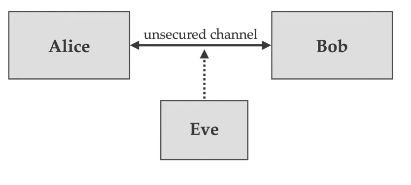

# Intro to Cryptography

Cryptography is generally about securing communications in the presence of malicious adversaries

'Eve' in this case is a malicious adversary able to read, modify, inject and delete data sent between Alice and Bob

## Goals of Cryptography

1) **Confidentiality**: keeping data secret from all but those authorized to see it. Done via encryption
2) **Data Integrity - Authentication**: Ensuring data has not been altered by unauthorized means
3) **Data origin authentication - Authentication**: Corroborating the source of the data.
4) **Non-repudiation**: Preventing an entity from denying previous commitments or actions.

## Secure web Transactions

- **Transport Layer Security (TLS)**: The cryptographic protocol used by web browsers to securely communicate with websites
  - TLS is used to ensure an individual user (client) of the authenticity of the website (server) they are visiting and to establish a secure communications channel for the remainder of the session
- **Symmetric-key cryptography**: The client and server a priori share some secret information k called a key.
  - They can subsequently encage in secure communication by encrypting their messages with **AES* and authenticating the resulting ciphertexts with *HMAC*
  - How can a secret key be shared safely?
- **Public-key cryptography**: The client and server a priori share some *authenticated* (but not-secret) information.
  - To establish a secret key, Alice sends a secret session key k and encrypts it with bobs RSA public key. Then only Bob can decrypt the resulting ciphertext with its RSA private key to recover k.
- **Signature scheme**: Bobs RSA public key is signed by a Certification Authority (CA) using its secret signing key with the RSA signature scheme.
  - alice can verify the signature of the CA's RSA public verification key. In this way, alice obtains an authentic copy of Bob's rsa public key.

## TLS protocol

1) When a client first visits a secured web page, the server transmits its certificate to the client
   1) The certificate contains the servers identifying information (ex: the website name and URL) and the RSA public key, and hte RSA signature of the certification authority
   2) The certification authority (ex: DigiCert) is trusted to carefully verify the server's identity before issuing the certificate.
2) Upon recept of the certificate, the client verifies the signature using the certification authority public key, which is embedded in the browser. A successful verification confirms the authenticity of the server and its RSA public key
3) The client selects a random **session key *k***, encrypts it with the server's RSA public key, and transmits the resulting ciphertext to the server.
4) The server decrypts the ciphertext to obtain the session key *k*, which is then used with symmetric-key encryption schemes to encrypt (ex: with AES) to authenticate (ex: with HMAC) all sensitive data exchanges for the remainder of the session.

### TLS Putential Vulnerabilities

1) The crypto is weak (ex: AES, HMAC, RSA)
2) The crypto can be broken using quantum computers
3) Weak random number generation
4) Issuance of fraudulent certificates
5) Software bugs - both inadvertent and malicious
6) Phishing attacks
7) TLS only protects data during transit; it offers no protection of data stored on the server
