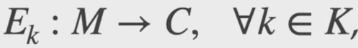
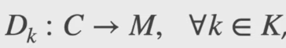
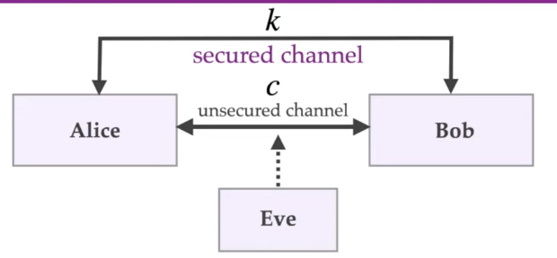
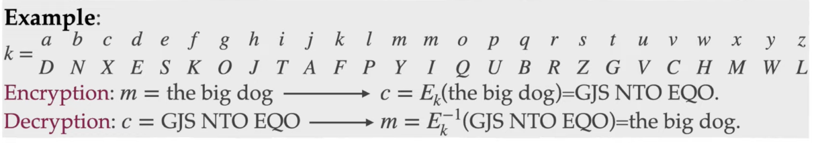
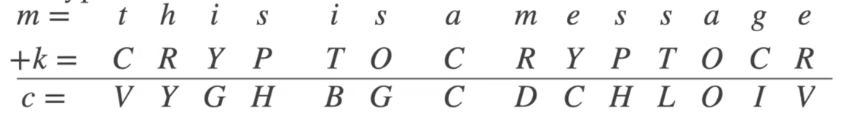

# 2.1 - Symmetric-Key Encryption

**Definition**: A symmetric-key encryption (SKES) consists of:

- *M* - the plaintext space
- *C* - the ciphertext space
- *K* - the keys space
- A family of encryption functions
  - 
  - For each key in the keyspace it defines a function  which converts plaintext to ciphertext
- A family of decryption functions
  - 
  - For each key in the keyspace it defines a function which converts ciphertext to plaintext
- 

## Using a SKES to achieve confidentiality

1) alice and bob agree on a secret key by communicating over a secured channel.
2) Alice computes c = Ek(m) and sends the ciphertext c to Bob over the unsecured channel.
3) Bob receives the plaintext by computing m = Dk(c)

Presumably, the secret key k might be used for a fixed time interval, or it might be used a fixed number of times.

## SKES Example - Simple substitution cipher

- *M* - all English messages
- *C* - the encrypted messages
- *K* - all permutations of the English alphabet
- *Ek(m)* - apply permutation *k* to *m*, one letter at a time
- *Dk(c)* - apply the inverse permutation *k^(-1)* to *c* one letter at a time

### Security of SSC

- Weak to exhaustive key search. Given sufficient amounts of ciphertext c, decrypt c using beach possible key until c decrypts to a plaintext message that 'makes sense'
- In princible, 30 charcters of ciphertext are sufficient on average to yield a unique plaintext that is a sensible english message. In practice, a few hundred characters are needed.

## Measureing security of an encryption model

1) What are the computation powers of the adversary?
2) How does the adversary interact with the two communication parties
3) what is the adversary's goal?

### Security model

Defines the computation abilities of the adversary and how they interact with the communicating parties

- **Information-theoretic security**: The adversary has infinite computational resources - typically impractical.
- **Complexity-theoretic security**: The adversary is a "polynomial-time turing machine" - usually asymptotic in results.
- **Computational security**: The adversary has a reasonable upper bounded amount of computation power - realistically we assume the adversary has the 'most powerful' computer realistically available.
  - Example: we can assume that the adversary has access to a large datacenter with millions of CPU cores.
- **Convention**: Always strive to model maximal adversary capabilities and minimal adversary goals
- **Basic assumption**: The adversary knows everything about the SKES, except the particular key *k* chosen by Alice and Bob. (Avoid security by obscurity)

### Adversary interaction

- **Passive attacks**:
  - *Ciphertext-only attack*: the adversary knows some cypher text (that was generated by alice or bob)
  - *Known-plaintext attack*: The adversary knows some plaintext and the corresponding ciphertext
    - Ex: email headers
- **Active attacks**:
  - *Chosen-plaintext attacks*: The adversary can also choose some plaintext and obtains the corresponding ciphertext (from alice or bob)
- Other attacks like blackmail, bribery, physical access to a computer with the keys, etc. are also issues. But these cannot be protect against by cryptographic means.

### Adversary's goal

1) Recover the secret key *k*
2) Systematically recover plaintext from ciphertext, without necessarily learning *k*
3) Learn some partial information about the plaintext from the ciphertext, other than its length.

- A system is **totally insecure (or totally broken)** if the adversary can achieve 1 or 2
- If the adversary cannot learn any partial information about the plaintext from the ciphertext (except possibly its length), the SKES is said to be **semantically secure**

### Definition of a secure SKES

> Definition: A symmetric-key encryption scheme is said to be *secure* if it is semantically secure against chosen-plaintext attacks by a <ins>computationally bounded</ins> adversary.

To break a symmetric-key encryption scheme, the adversary has to accomplish the following:

1) The adversary is given a challenge ciphertext c, generated bt either Alice or Bob using their secret key k
2) During its computation, the adversary can select arbitrary plaintexts and obtain the corresponding ciphertexts.
3) After a feasible amount of computation, the adversary obtains some information bout the plaintext m corresponding to c (other than the length of m)

### Desirable properties of a SKES

1) Efficient algorithm should be known for computing Ek and Dk (for encryption and decryption)
2) the secret key k should be small, but large enough to render exhaustive key search infeasible
3) The scheme should be secure.
4) The scheme should be secure even against the designer of the system - no backdoors.

## Work factor

- 2^40 operations is considered very easy
- 2^56 operations is considered easy
- 2^64 operations is considered feasible
- 2^80 operations is considered barely feasible
  - the bitcoin network is performing this amount of hash operations per hour
- 2^128 operations is considered infeasible
  - The Landauer limit from thermodynamics suggests that exhaustively trying 2^128 symmetric keys would requite more than 3000 gigawatts of power for one year, which is more than 100% of humanities global energy production.

### Security level

A cryptographic scheme is said to have a security level of *l* bits if the fastest known attack on the scheme takes approximately 2^*l* operations. As of 2024, a security level of 128 bits is desirable in practice.

## Polyalphabetic ciphers

- Basic idea: Use several permutations, so a plaintext letter is encrypted to one of several possible ciphertext letters.
- Example: Vigenere cipher
  - The secret key is an english word having no repeated letters; k = CRYPTO
  - 
  - Here, A = 0, B = 1, ..., Z = 25, and addition of letters is modulo 26
  - decryption is subtraction modulo 26: m = c - k
  - The frequency distribution of ciphertext letters is flatter than for a siple substitution cipher
