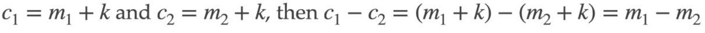
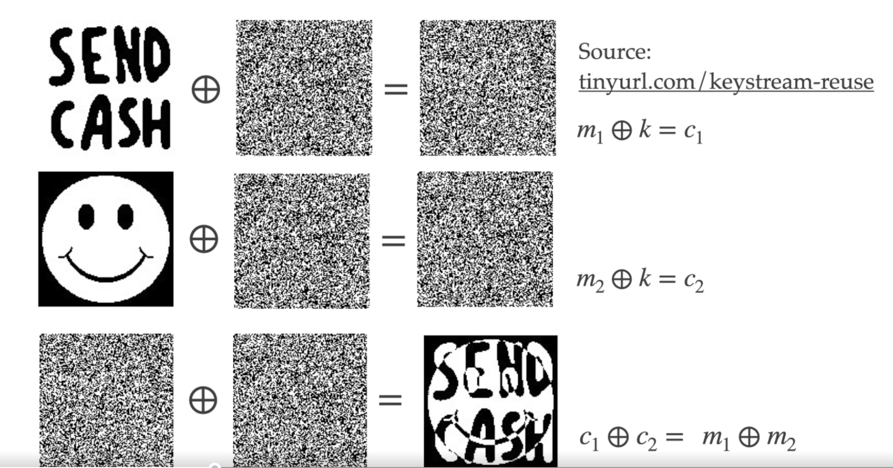

# 2.2 - Stream Cipher

A **Stream Cipher** is a SKES that encrypts the plaintext one *bit* at a time.

## One Time Pad

- Invented by Vernam in 1917 for the telegraph system.
- The secret key is a random string of letters hte same length as the plain text
- Example of encryption
  - 
- The key shoud not be re-used
  - 
  - So, c1 - c2 depedns only on the plaintext (and not on the key k) and hence can leak information about the plaintexts m1 and m2 if the keys are the same.
  - 

## Scream Cipher

- **Basic idea**: insrtead of using a random key in the one time pad, use a "pseudorandom" key.
  - **Definition**: a pseudorandom bit generator (PRBG) is a determinstic algorithm that takes as input a (random) seed, ad outpits a longer pseudorandom sequence called the keystream.
- Stream Ciphers use a PRBG for encryption. The seed is th secret key shared by Alice and Bob.
  - **Encryption**: (Seed -> PRBG -> Keystream) XOR plaintext = ciphertext
    - Seed is fed into PRBG to generate the keystream.
  - **Decryption**: (Seed -> PRBG -> Keystream) XOR ciphertext = plaintext
- No more perfect secrecy - security depends on the quality of the PRBG
- Again, they should not be reused.

### Security requirements for the PRBG

- **Indinstinguishibility requirment**: the keystream shoudl be indistinguishable from a random sequence.
- **Unpredictibility requiremebt**: 