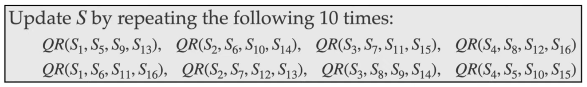

# 2.2 - Stream Cipher

A **Stream Cipher** is a SKES that encrypts the plaintext one *bit* at a time.

## One Time Pad

- Invented by Vernam in 1917 for the telegraph system.
- The secret key is a random string of letters hte same length as the plain text
- Example of encryption
  - 
- The key shoud not be re-used
  - 
  - So, c1 - c2 depedns only on the plaintext (and not on the key k) and hence can leak information about the plaintexts m1 and m2 if the keys are the same.
  - 

## Stream Cipher

- **Basic idea**: instead of using a random key in the one time pad, use a "pseudorandom" key.
  - **Definition**: a pseudorandom bit generator (PRBG) is a deterministic algorithm that takes as input a (random) seed, ad outputs a longer pseudorandom sequence called the keystream.
- Stream Ciphers use a PRBG for encryption. The seed is th secret key shared by Alice and Bob.
  - **Encryption**: (Seed -> PRBG -> Keystream) XOR plaintext = ciphertext
    - Seed is fed into PRBG to generate the keystream.
  - **Decryption**: (Seed -> PRBG -> Keystream) XOR ciphertext = plaintext
- No more perfect secrecy - security depends on the quality of the PRBG
- Again, they should not be reused.

### Security requirements for the PRBG

- **Indistinguishablity requirement**: the keystream should be indistinguishable from a random sequence.
- **Unpredictability requirement**: Given portions of the keystream, it should be computational infeasible to learn any information about he remainder of the keystream. If an adversary knows a portion c1 of the ciphertext and the corresponding plaintext m1, then they can easily find the corresponding portion *k1 = c1 XOR m1* of the keystream.
  - UNIX random number generators - rand and srand - are not random enough cor cryptographic purpose. The values used to generate the random value are fixed and public.

## ChaCha20 Stream Cipher

- Designed by Dan Bernstein in 2008
- Stream cipher is conceptually very simple, word orientated and uses only simple arithmetic operations - integer addition modulo 2^32, xor, and left rotations.
- It is extremely fast in software and does not require any special hardware
- To date, no security weaknesses have been found and thus is widely used in practice including in TLS

### ChaCha20 Inital State

- 512-bit total:
  - 256-bit key k = (k1, k2, ..., k8)
  - 128-bit constant f = (f1, f2, f3, f4)
    - These are hexadecimals
  - 96-bit nonce n = (n1, n2, n3)
    - An Initializing Value (IV)sis a non-repeating quantity
  - 32-bit counter c.

### ChaCha20 Quarter Round Function

### ChaCha20 Keystream Generator

The keystream bytes are XORed with the plaintext bytes to produce ciphertext bytes. The nonce is appended to the ciphertext

