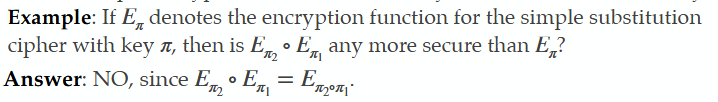

# 2.3 - Block Cipher and DES

- A **Block Cipher** is a symmetric-key encryption scheme (SKES) that breaks up the plaintext into blocks of a fixed length (ex 128 bits), AND encrypts the plaintext one *block* at a time.
- In contrast, a stream cipher encrypts the plaintext one character (usually a bit) at a time.
- An historically important example of a block cipher is the Data Encryption Standard (DES).
  - key length: **56 bits**, size of key space: **256**, block length: **64 bits**

## Desirable properties of a DES

- **Security**:
  - *Diffusion*: each ciphertext bit should depend on all plaintext bits.
  - *Confusion*: the relationships between key and ciphertext bits should be complicated
  - *Key length*: should be small, but large enough to preclude exhaustive key search
- **Efficiency**
  - *Simplicity*: easier to implement and analyze
  - *Speed*: high encryption and decryption rates
  - *Platform*: suitable for hardware and software

## Block Ciphers: Multi-DES

The only (substantial) weakness known in DES are the obvious ones: small key length and small block length. To remedy this:

- Multiple encryption: Re-encrypt the ciphertext one or more times using independent keys. Hope that this increases the effective key length.
- This does not necessary result in increased security:
  - 

### Double-DES

- A double-DES secret key is k = (k1, k2) where k1,k2 are random elements of {0,1}56
  - Assume chosen uniformly and independently at random
- **Encryption** is c = Ek2(Ek1(m)) where E=DES encryption

- **Decryption** is: m = Ek1-1(Ek2-1(c)) where E-1 is DES decryption
  - The double DES key length is l = 112 bits, so exhaustive key search takes 2112 operations which is infeasible.
  - Block length is unchanged at 64 bits.

