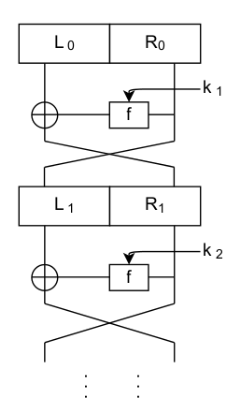

# 2.3 - Block Cipher and DES

- A **Block Cipher** is a symmetric-key encryption scheme (SKES) that breaks up the plaintext into blocks of a fixed length (ex 128 bits), AND encrypts the plaintext one *block* at a time.
- In contrast, a stream cipher encrypts the plaintext one character (usually a bit) at a time.


> *b*: block size (typically 64 or 128 bits);
> *n*: key size (typically 128 or 256 bits)

### Examples

- AES: *b* = 128 bits, *n* = 128/192/256 bits
- 3DES: *b* = 64 bits, *n* = 168 bits (112 effective bits)

- An historically important example of a block cipher is the **Data Encryption Standard (DES)**.
  - key length: **56 bits**, size of key space: **2<sup>56</sup>**, block length: **64 bits**

### Symmetric Encryption with Block Ciphers


- Block cipher is keyed random permutation
- Dec<sub>k</sub>( ) = Enc<sub>k</sub><sup>-1</sup>( ); Decryption is the inverse mapping of Encryption
- Building blocks:
  - **Confusion**: obscure message and key symbols e.g by replacement (shift cipher, substitution cipher, etc)
  - **Diffusion**: mixing and reordering of information -> making local changes global (eg: scytale bit permutation)

## Feistel Network (eg. DES)



- Structure:
  - *L<sub>0</sub>||R<sub>0</sub> := m<sub>i</sub>*
  - *L<sub>i</sub> := R<sub>i-1</sub>*
  - *R<sub>i</sub> := L<sub>i-1</sub>* XOR *f(R<sub>i-1</sub>, k<sub>i</sub>)*
- *f* like SPN, does not have to be invertible
- **Decryption** has the same structure
- Removes structure given by invertibility, but requires more rounds (only half of state updated per round)

## Substitution Permutation Network (SPN)


- Direct implemetnation of confusion +  diffusion
- S-boxes must be invertable (decryption)
- Avalance effect: changing 1 bit -> 2 bits of S-box output change -> affects 2 S-boxes in next round. With enough rounds all output bits are affected.

# Data Encryption Standard (DES)

- Encrypts blocks of size 64 bits
- Uses a key of size 56 bits
- Uses 16 identical rounds
- Symmetric cipher
  - Same key for encryption and decryption
- Different subkey for each round derived from main key


- Bitwise inital permutation, then 16 rounds
- Plaintext is split into 32-bit halves L<sub>i</sub> and R<sub>i</sub>


- L and R swapped at the end of the cipher - after round 16
- Followed by one final permutation

## DES *f* function

Main operation of DES:


- f-Function inputs:
  - R<sub>i-1</sub> and round key k<sub>i</sub>
- Function has 4 steps:
  
### 1: Expansion *E*

Main purpose is to increase diffusion. 32 ints -> 48


```go
[8][6]byte{
		{32,  1,  2,  3,  4,  5},
		{4,   5,  6,  7,  8,  9},
		{8,   9, 10, 11, 12, 13},
		{12, 13, 14, 15, 16, 17},
		{16, 17, 18, 19, 20, 21},
		{20, 21, 22, 23, 24, 25},
		{24, 25, 26, 27, 28, 29},
		{28, 29, 30, 31, 32,  1},
	}
  ```

### 2: XOR with round key

Bitwize XOR of round key *k<sub>i</sub>* adn the expansion function output *E*

### 3: S-box substitution


> this is S1

- Eight different substitution tables
- 6 bits of input, 4 bits of output


### 4: Permutation P


- Bitwise permutation
- Introduces diffusion
- Output bits of one S-Box effect several S-Boxes in next round

#### 4.1 DES Key Schedule

- Derives 16 round keys (or subkeys) *k<sub>i</sub>* of 48 bits each from the origonal 56 bit key
- The input key size of the DES is 64 bit: 56 bit key and 8 bit parity
  


- Parity bits are removed in a first permuted choice (PC-1)
- (note that the bits 8, 16, 24, 32, 40, 48, 56 and 64 are not used at all)


- Split key into 28-bit halves: *C<sub>0</sub>* and *D<sub>0</sub>*
  - In rounds *i = 1,2,9,16* the two halves are each rotated left by **1 bit**
  - In all other rounds, each half is rotated left by **2 bits**
- In each round *i* **PC-2** selects a permuted subset of 48 bits of *C<sub>i</sub>* and *D<sub>i</sub>* as round key *k<sub>i</sub>*
  - Each *k<sub>i</sub>* is a permuted choice of *k*
- The total number of rotations:
  - (4 \* 1) + (12 \* 2) = 28
  - Hence: *C<sub>0</sub> = C<sub>16</sub>* and *D<sub>0</sub> = D<sub>16</sub>*


## DES Decryption

- Only the **key schedule** has to be modified
- Generate the same 16 round keys in reverse order


Reversed key schedule:

- As *D<sub>0</sub>=D<sub>16</sub>* the first round key can be generated by applying *PC-2* right after *PC-1* (no rotation here!)
- ALL other rotations of *C* and *D* can be reversed to reproduce the other round keys resulting in:
  - No rotation in round 1
  - One bit rotation **to the right** in rounds 2, 9 and 16.
  - Two bit rotations **to the right** in all other rounds.

## Block cipher 1: 3DES

## Tripple-DES (3DES)


- Encrypt 3 times using 3 different keys
- Effective security: 112bits
- Legacy solution: still used (secure, albeit slow)

## Desirable properties of a DES

- **Security**:
  - *Diffusion*: each ciphertext bit should depend on all plaintext bits.
  - *Confusion*: the relationships between key and ciphertext bits should be complicated
  - *Key length*: should be small, but large enough to preclude exhaustive key search
- **Efficiency**
  - *Simplicity*: easier to implement and analyze
  - *Speed*: high encryption and decryption rates
  - *Platform*: suitable for hardware and software

### Double-DES

- A double-DES secret key is k = (k1, k2) where k1,k2 are random elements of {0,1}<sup>56</sup>
  - Assume chosen uniformly and independently at random
- **Encryption** is c = Ek2(Ek1(m)) where E=DES encryption


- **Decryption** is: m = Ek1<sup>-1</sup>(Ek2<sup>-1</sup>(c)) where E<sup>-1</sup> is DES decryption
  - The double DES key length is l = 112 bits, so exhaustive key search takes 2<sup>112</sup> operations which is infeasible.
  - Block length is unchanged at 64 bits.


