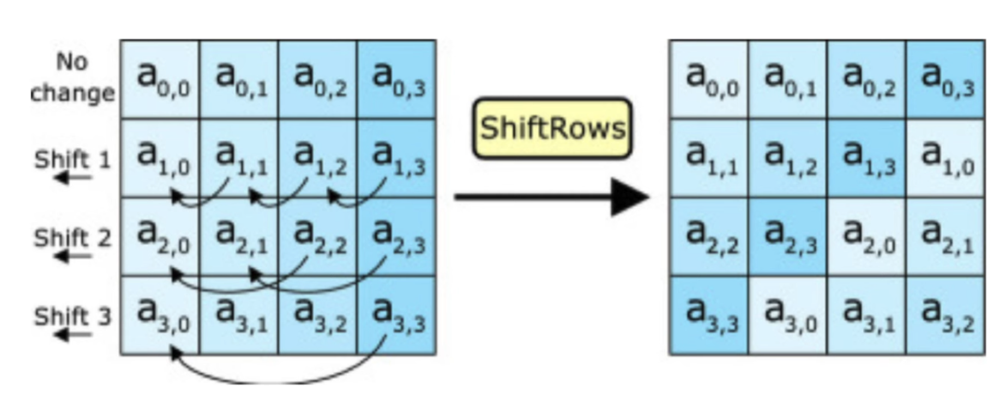
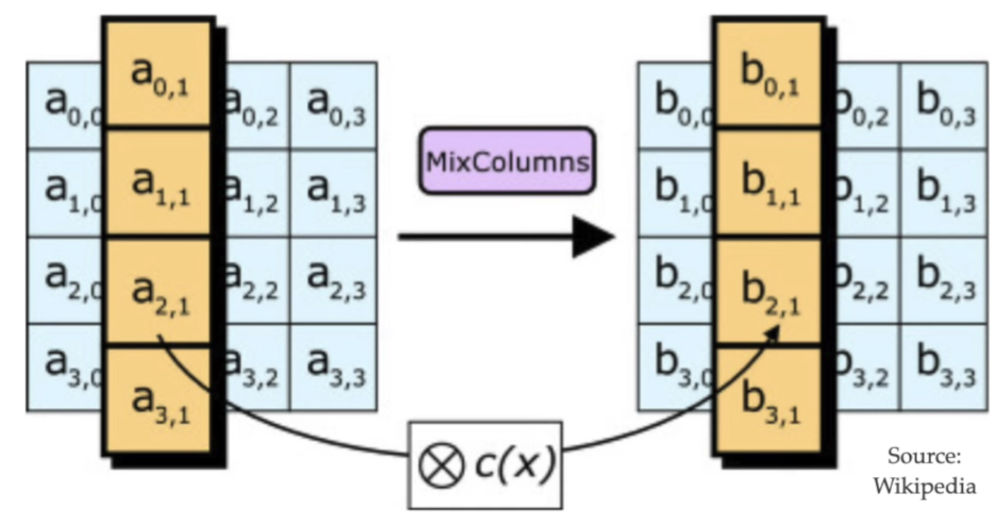
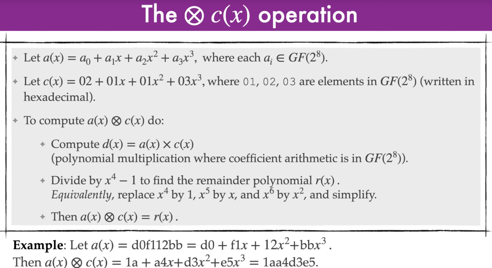
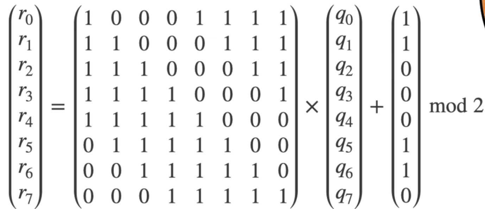
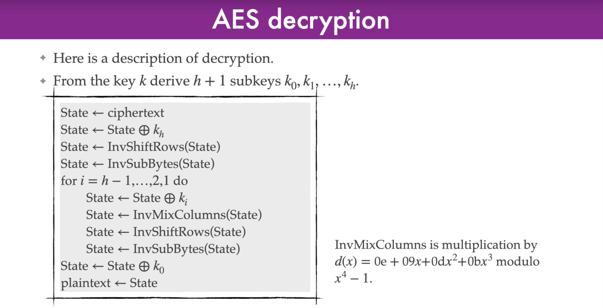
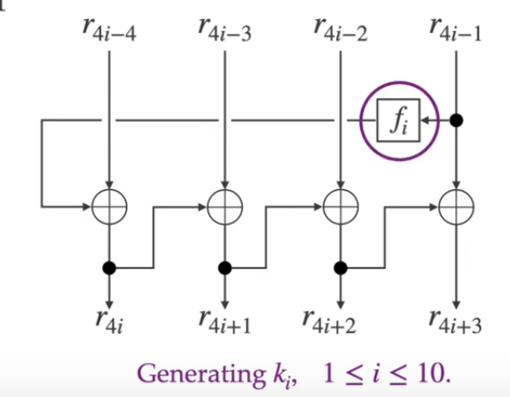

# AES

Most commonly used block cipher

- Key lengths: 128, 192, and 256 bits
- block length 128 bits
- No attack has been found as of 2024 that are significantly faster than an exhaustive key search

## Substitution Permutation Networks

A SPN is an iterated block cipher where a round consists of a substitution operation followed by a permutation operation.

- *n* : the block length (*n* bits)
- *l* : the key length (*l* bits)
- *h* : the number of rounds
- A fixed invertible function *S* : {0,1}*b * -> {0,1}b called a **substitution**, where *b* is a divisor of *n*
- A fixed **permutation** *P* on {1,2,...,*n*}
  - A permutation is effecively a shuffle where bits 1-4 get moved to the position of bits 8-12 for example
- A **Key scheduling algorithm** that determines subkeys k1, k2, ..., k*h*, k*h*+1

<ins>Note</ins>: *n, l, h, S, P* and **key scheduling algorithm** are public. The only secret in AES is the key *k* that is selected.

### Steps

- Encryption:
  - *A <- plaintext*
  - for *i* = 1,2,...h do
    - A <- A XOR *ki* : replace A with A XORed with the first key
    - A <- S(A)                  : substitution function
    - A <- P(A)                  : permutation function
  - A <- A XOR *Kh+1* : replace A with A XORed with  the final key
  - A is now the cipher text!
- Decryption is hte opposite of encryption

## AES Basics

- AES is a type of SPN algorithm, where hte permutation operation operation of two invertible linear transformations.
- All operations are **byte oriented**, e.g. *b* = 8 so the S-box maps 8 bits to 8 bits.
- The block length of AES is *n* = 128
  - Each subkey is 128 bits
- AES accepts three key lengths. The number of rounds *h* depends on key length
  - AES-128: key length = 128, number of rounds = 10
  - AES-192: key length = 192, number of rounds = 12
  - AES-256: key length = 256, number of rounds = 14

## AES Encryption Round operations

- Each round updates a variable called *State* which consists of a 4 X 4 array of bytes (len 4, height 4, bits 8 = 128)
- **State** is initialized with the plaintext
  - 16 bytes of plaintext init
  - 
- Each AES round uses four invertible operations:

### 1 - AddRoundKey (key mixing)

Bitwise-XOR each byte of **State** with the corresponding byte of the subkey.

### 2 - SubBytes (S-box)

Take each byte in **State** and replace it with output of the S-box

***S* : {0,1}8 -> {0,1}8** is a fixed, public, invertible, non-linear function
> turn a byte into a new byte

### 3 - ShiftRows (permutation)

Permute the bytes of **State** by applying a cyclic shift to each row

### 4 - MixColumns (linear transformation)

- Read column *i* of **State** as a polynomial
  - (a0,*i*, a1,*i*<, a2,*i*, a3,*i*) = a0,*i*, a1,*i*x, a2,*i*x2, a3,*i*x3
- Multiply this polynomial with the constant polynomial c(x) = 02 + 01x + 01x2 + 03x3
  - The constants are hexadecimal values in space GF(28)
  - This gives a new polynomial: b0,*i*, b1,*i*x, b2,*i*x2, b3,*i*x3

### Step 5

- The final pass of the encryption algorithm does not apply  MixColumns for the *i*th time.
- After *h* rounds are completed, a final subkey is XORed with **State**, the result being the ciphertext

## How to use an S-box

First we must understand finite field GF(28) works

### GF(s8)
 A finite field is a set of numbers where you can add, subtract, multiply, and divide (except by zero), and always get another number in the set. In AES, the field is called GF(28).

- f(y) = y8 + y4 + y3 + y + 1

**Example**:

- *a* = 11101100 = 1110 1100 = **ec**
  - a(y) = y7 + y6 + y5 + y3 + y2
- *b* = 00111011 = 0011 1011 = **3b**
  - b(y) = y5 + y4 + y3 + y + 1

- **Addition**:
  - a(y) + b(y) = y7 + y6 + y4 + y2 + y + 1
    - Note how the same polynomials cancel out (y5 & y3).
    - 1+1 = 0, 0+0 = 0, 1+0/0+1 = 1
  - ec + 3b = d7
    - [ec]  11101100 +
    - [3b]  00111011 =
    - [d7] *11010111*
  - This is just a bitwise addition mod 2 - or an XOR
- **Multiplication:**
  - Let *a* = **ec** (1110 1100), *b* = **3b** (0011 1011)
  - a(y) = y7 + y6 + y5 + y3 + y2
    - Binary: 11101100
  - b(y) = y5 + y4 + y3 + y + 1
    - Binary: 00111011
  - **Step 1: Multiply polynomials**
    - Multiply each term in a(y) by each term in b(y), add exponents, and sum all results (mod 2, so terms cancel if they appear twice).
    - For example
      - y7 * y5 = y12
      - y7 * y4 = y11, etc.
    - After expanding and combining like terms, you get: y12 + y10 + y8 + y4 + y2
      - Binary: 1010100010100 (13 bits, y12 to y0)
  - **Step 2: Reduce mod f(y)**
    - If any terms have degree 8 or higher, reduce them by repeatedly XORing (subtracting mod 2) f(y) shifted left so its highest term matches the term you want to cancel.
    - For example:
      - T reduce y12, shift f(y) left by 4 to get y12 + y8 + y7 + y5 + y4
        - Binary: 1000101100000
      - Then XOR with your result to cancel y12.
        - 1010100010100 XOR 1000101100000 = 10001110100
    - Repeat for all terms of degree 8 or higher until only degrees 0–7 remain.
    - The remainder after division by f(y) is r(y) = y7 + y6 + y3
      - Binary: 11001000
    - So, ec × 3b = c8 in GF(2⁸) (11001000 in binary)
- **Inversion**:
  - **Example:**
    - Let *a* = **53** (0101 0011)
    - The inverse of *a* is the value *b* such that a × b = 1 in GF(2⁸)
    - For 53, the inverse is **ca** (1100 1010), because 53 × ca = 1 (using the multiplication rule above)
  - In practice, finding the inverse is done with the Extended Euclidean Algorithm or a lookup table

### AES S-Box

- An s-box is basically a grid search.
- In AES, every nonzero byte has an inverse in GF(2⁸)

#### Example

- Consider a byte (8 binary string) *p*
  - *p* is an element of GF(28)
- if *p* is non-0, then *q* is the inverse of *p*. If *p* is 0, *q* = *p*
- *q* = (q7, q6, q5,...q1, q0)
- Next we computer the following:

- Then S(*p*) = *r* = (r7, r6, r5,...r1, r0)

## AES Decryption

## AES Key schedule (for 128-bit keys)

- For 128-bit keys, AES has 10 rounds - therefor 11 subkeys are needed
- The first subkey is *k0* = (r0, r1, r2, r3) and is the actual AES key
- the second subkey is k1 = (r4,r5,r6,r7)
- etc...
- the eleventh subkey is k10 and is (r40, r41, r42, r43)

### AES key schedule function *fi*

The function *fi* : {0,1}32 -> {0,1}32

- The input is divided into four bytes: (a,b,c,d)
- Left rotate the bytes: (b,c,d,a)
- Apply the AES S-box to each byte: (S(b), S(c), S(d), S(a))
- XOR the leftmost byte with the constant *li* and output the result:
  - (S(b) XOR *li*, S(c), S(d), S(a))
- The constants *l* (in hexadecimal)
  - *l1* = 01, *l2* = 02, *l3* = 04, *l4* = 08, *l5* = 10, *l6* = 20, *l7* = 40, *l8* = 80, *l9* = 1b, *l10* = 36
  - 