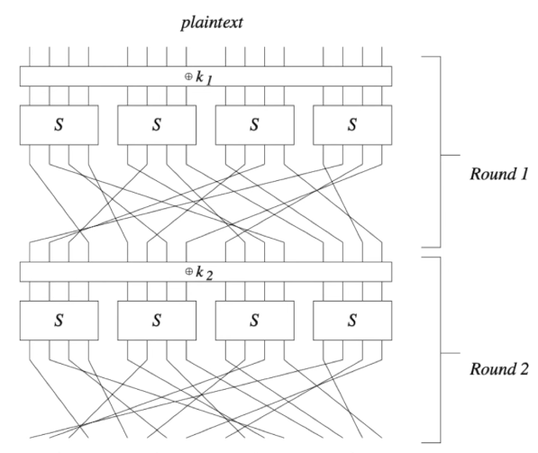
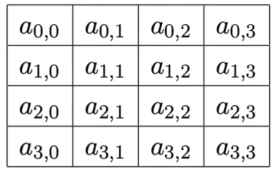
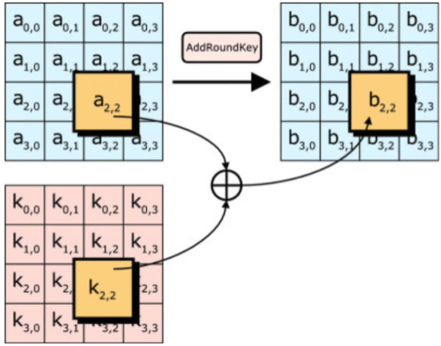
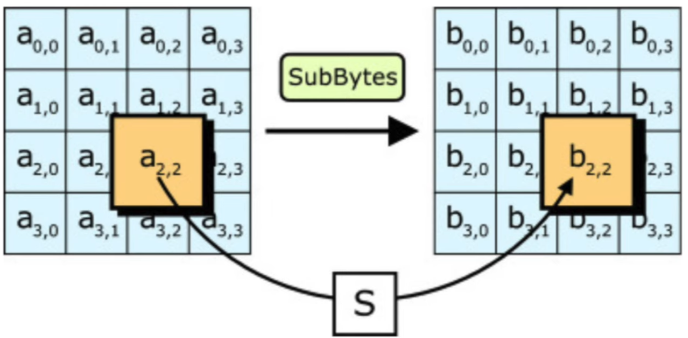
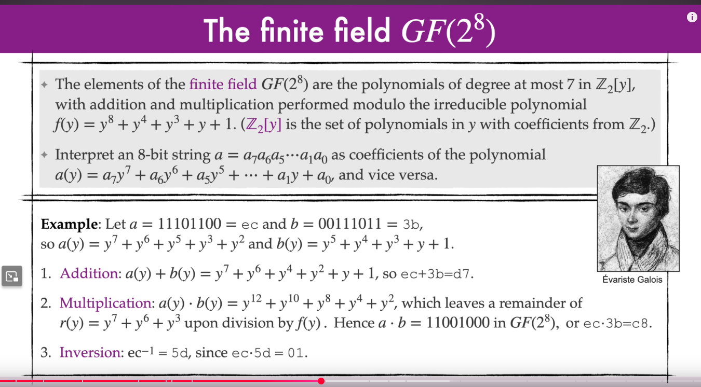
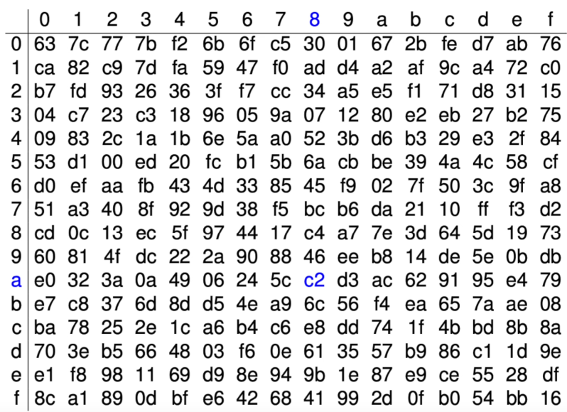

# AES

Most commonly used block cipher

- Key lengths: 128, 192, and 256 bits
- block length 128 bits
- No attack has been found as of 2024 that are significantly faster than an exhaustive key search

## Substitution Permutation Networks

A SPN is an iterated block cipher where a round consists of a substitution operation followed by a permutation operation.

- *n* : the block length (*n* bits)
- *l* : the key length (*l* bits)
- *h* : the number of rounds
- A fixed invertible function *S* : {0,1}*b* -> {0,1}b called a **substitution**, where *b* is a divisor of *n*
- A fixed **permutation** *P* on {1,2,...,*n*}
  - A permutation is effecively a shuffle where bits 1-4 get moved to the position of bits 8-12 for example
- A **Key scheduling algorithm** that determines subkeys k1, k2, ..., k*h*, k*h*+1

<ins>Note</ins>: *n, l, h, S, P* and **key scheduling algorithm** are public. The only secret in AES is the key *k* that is selected.

### Steps

- Encryption:
  - *A <- plaintext*
  - for *i* = 1,2,...h do
    - A <- A XOR *ki* : replace A with A XORed with the first key
    - A <- S(A)                  : substitution function
    - A <- P(A)                  : permutation function
  - A <- A XOR *Kh+1* : replace A with A XORed with  the final key
  - A is now the cipher text!
- Decryption is hte opposite of encryption

## AES Basics

- AES is a type of SPN algorithm, where hte permutation operation operation of two invertible linear transformations.
- All operations are **byte oriented**, e.g. *b* = 8 so the S-box maps 8 bits to 8 bits.
- The block length of AES is *n* = 128
  - Each subkey is 128 bits
- AES accepts three key lengths. The number of rounds *h* depends on key length
  - AES-128: key length = 128, number of rounds = 10
  - AES-192: key length = 192, number of rounds = 12
  - AES-256: key length = 256, number of rounds = 14

## AES round operations

- Each round updates a variable called *State* which consists of a 4 X 4 array of bytes (len 4, height 4, bits 8 = 128)
- **State** is initialized with the plaintext
  - 16 bytes of plaintext init
  - 
- Each AES round uses four invertible operations:

### 1 - AddRoundKey (key mixing)

Bitwise-XOR each byte of **State** with the corresponding byte of the subkey.

### 2 - SubBytes (S-box)

Take each byte in **State** and replace it with output of the S-box

***S* : {0,1}8 -> {0,1}8** is a fixed, public, invertible, non-linear function
> turn a byte into a new byte 

### 3 - ShiftRows (permutation)

### 4 - MixColumns (linear transformation)

- After *h* rounds are completed, a final subkey is XORed with **State**, the result being the ciphertext

## S-box

- Consider a byte (8 binary string) *p*
- *q* is the inverse of *p*
- An s-box is basically a grid search.
- 
