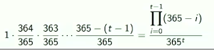
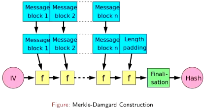
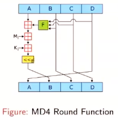
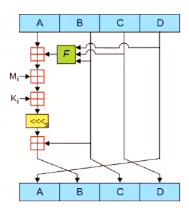
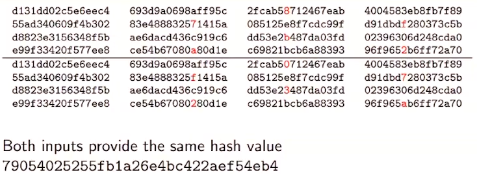
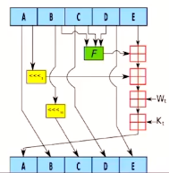
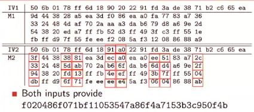
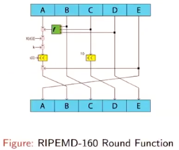
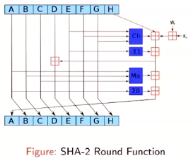
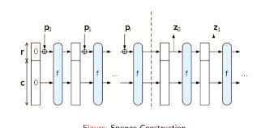

# 3.1 - Hash Functions

A hash function `h()` is a keyless algorithm that takes a variable length input `x` and returns an output `y` of fixed length `n (message digest length)`.

## Cryptographic Hash Functions

We expect cryptographic hash functions to satisfy the following properties

### 1. Preimage Resistance

- Given an output `y` it should be hard to find any input `x` such that `h(x) = y`.
- A generic attach would require around `2^n` operations
- Example:
  - In a password file one does not store (`username, password`) but store (`username, hash(password`)
  - This is sufficient to verify a password
  - An attacker that captures the password file has to find a preimage

### 2. Second Preimage Resistance

- Given an out `y` and input `x1` such that `h(x1) = y`, it should be hard to find any other input `x2` such that `h(x2) = y`
- A generic attack would require around 2^n operations
- Example:
  - Store the hashes of your files on your computer or write them down on paper
  - If the attacker modifies the files (ex: put a malicious code inside them) and can still obtain the same hash value, then the attacker can fool you.

### 3. Collision Resistance

- It should be hard to find two inputs `x1` and `x2` such that `h(x1) = h(x2)`
- A generic attack would require around 2^(n/2) operations due to birthday paradox
- Example:
  - Hacker prepares two versions of a software driver for an OS where `x` is correct and `x'` contains a backdoor that allows access to the machine
  - Hacker sends `x` to the OS company for inspection
  - OS company signs the `h(x)` with their private key
  - Havcker distributes `x'` to the users who verify the signature on `x` with OS companies public key
  - Since `h(x) == h(x')`, the signature works

## Birthday Paradox

- How many people need to be in a room before it is more likely than not at least two people share a birthday? (Probability > 0.5)
- Solution:
  - Consider the probability that nobody shares a birthday. The first person in the group has a birthday  on a given day. To avoid a match, the second person is left with 364 potions, the third has only 363 and so on. The probability that we dont have any matches among a group of `t` people is:

## Design of Hash Functions

Iterated Construction

- Many hash functions adopt an iterative design to acomidate a variable length input
- Merkle-Damgard construction is the most famous example
- Message *M* is divided into fixed length blocks `M = m0 ||m1||m2||...||mt` and a suitable padding is applied
- Message blocks are compressed one after the other to produce *h*; using a compression function *f*
- *hi* is called a chaining variable and used in the compression of next mesage block `m(i + 1)`
  - compression function uses *mi* and *hi-1* to produce *hi*
- *h0* is fixed and specified as a part of the hash function specifications
- A finalization operation is applied to overcome some attacks

4

### MD4

- Block size: 512 bits
- Message digest length: n = 128 bits
- Number of rounds is 48
- A, B, C, D are state words of 32 bits, Mi is the ith message block

### MD5

- Block size: 512 bits
- Message digest length: n = 128 bits
- Number of rounds is 64
- Collision resistance - generating a collision requires 2^18 operations (less than a second on a normal computer)

### SHA-1

- Block size: 512 bits
- Message digest length: n = 160 bits
- Number of rounds: 80
- Collision resistance: 2^63

### RIPEMD-160

- Block size: 512 bits
- Message digest length: n = 128, 160, 256, 320 bits
- Number of rounds: 80
- Collision resistance: 2^80 (due to birthday paradox)
- Only remaining 160 bit digest size hash function that has not been broken yet.

### SHA-2

- Block size: 512 or 1024 bits
- Message digest length: n = 224, 256, 384, 512 bits
- Number of rounds is 60 or 80
- Collision resistance: Pseudo-collision attack against up to 46 rounds of SHA-256

### SHA-3

- Block size: 1152, 1088, 832, 576 bits
- Message digest length: n = 224, 256, 384, 512
- Number of rounds: 64 or 80
- Sponge Construction
  - pi are input, zi are hashed output.
  - The unused "capacity" c should be twice the desired resistance to collision or preimage attacks.
